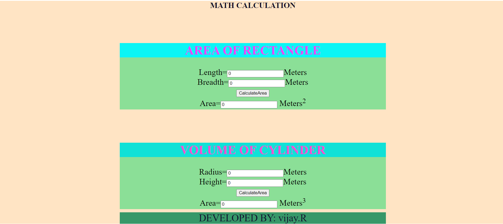
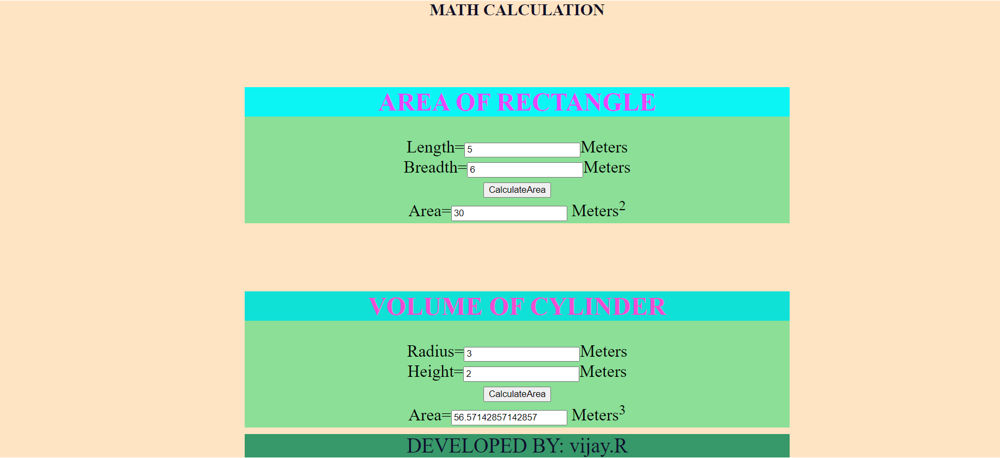

# AngularCalculation

# Web Page for Mathematical Calculations using Angular

## AIM:
To design a dynamic website to perform mathematical calculations using Angular Framwork

## DESIGN STEPS:

### Step 1:

Requirement collection.

### Step 2:

Creating the layout using HTML and CSS in component.html file

### Step 3:

Write typescript to perform the calculations.

### Step 4:

Validate the layout in various browsers.

### Step 5:

Validate the HTML code.

### Step 6:

Publish the website in the given URL.

## PROGRAM :

### Rectangle:

#### Rectangle.component.html:

```
<style>
    h2{
background-color: rgb(11, 245, 245);
color: rgb(232, 69, 250);
}
.container {
  display: block;
  background-color: #8bdf97;
  min-height: 200px;
  margin-top: 100px;
}
.al{
    text-align: center;
    font-size: 25px;
}

</style>

<div class="container">
    <div class="al">
    <h2>AREA OF RECTANGLE</h2>
    Length=<input type="text"[(ngModel)]='length'>Meters<br/>
    Breadth=<input type="text"[(ngModel)]='breadth'>Meters<br/>
    <input type="button" (click)="onCalculate()" value="CalculateArea"><br/>
    Area=<input type="text" [value]="area"> Meters<sup>2</sup><br/>

</div>

```

#### Rectangle.component.ts:

```
import { Component } from "@angular/core";

@Component({
    selector:'Rectangle-Area',
    templateUrl:'./rectangle.component.html'
})
export class RectangleComponent{
    length:number;
    breadth:number;
    area:number;
    constructor(){
        this.length=0;
        this.breadth=0;
        this.area=0;


    }
    onCalculate()
    {
            this.area = this.length*this.breadth
    }
}


```

### Cylinder:

#### cylinder.component.html:

```
<style>
    h2{
background-color: rgb(16, 225, 215);
color: rgb(241, 77, 211);
}
.container {
  display: block;
  background-color: #8bdf97;
  min-height: 200px;
  margin-top: 100px;
}
.al{
    text-align: center;
    font-size: 25px;
}

</style>
<div class="container">
<div class="al">
    <h2>VOLUME OF CYLINDER</h2>
    Radius=<input type="text"[(ngModel)]='Radius'>Meters<br/>
    Height=<input type="text"[(ngModel)]='Height'>Meters<br/>
    <input type="button" (click)="onCalculate()" value="CalculateArea"><br/>
    Area=<input type="text" [value]="Area"> Meters<sup>3</sup><br/>

</div>

```

#### cylinder.component.ts:

```
import { Component } from "@angular/core";

@Component({
    selector:'Volume-cylinder',
    templateUrl:'./cylinder.component.html'
})
export class CylinderComponent{
    Radius:number;
    Height:number;
    Area:number;
    constructor(){
        this.Radius=0;
        this.Height=0;
        this.Area=0;


    }
    onCalculate()
    {
            this.Area =22/7*this.Radius**2*this.Height
    }
}

```

## App

### App.component.css:

```
h2{
    text-align: center;
    color: rgb(17, 14, 39);
    margin-top: 10px;


}
.container {
    width: 800px;
    margin-left: auto;
    margin-right: auto;
  }
  .backgd{
    background-color: bisque ;
}
  .footer{
      text-align: center;
      font-size: 30px;
      color: rgb(15, 15, 46);
      background-color: rgb(55, 152, 105);
      margin-top: 10px;
  }

```

### App.component.html:

```
<div class="backgd">
    <h2>MATH CALCULATION</h2>
    <div class="container">
        
<Rectangle-Area>

</Rectangle-Area>

<Cylinder-Vol>
  
</Cylinder-Vol>

<div class="footer">DEVELOPED BY: vijay.R</div>

    </div>

</div>

```

### App.module.ts:

```
import { NgModule } from '@angular/core';
import { FormsModule } from '@angular/forms';
import { BrowserModule } from '@angular/platform-browser';

import { AppComponent } from './app.component';
import { CylinderComponent } from './cylinder/cylinder.component';
import { RectangleComponent } from './rectangle/rectangle.component';

@NgModule({
  declarations: [
    AppComponent,RectangleComponent,CylinderComponent
  ],
  imports: [
    BrowserModule,FormsModule
  ],
  providers: [],
  bootstrap: [AppComponent]
})
export class AppModule { }

```


## OUTPUT:

### without output:



### with output:





## Result:


To design a dynamic website to perform mathematical calculations using Angular Framwork is successfully created.
